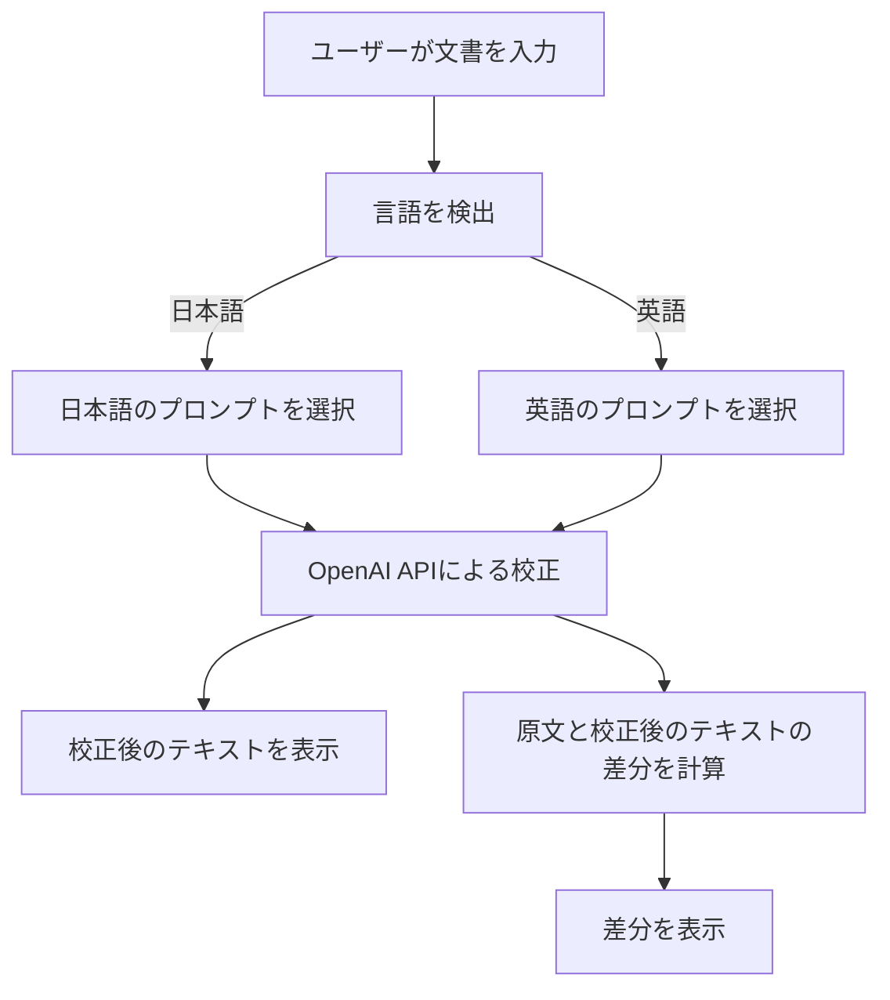
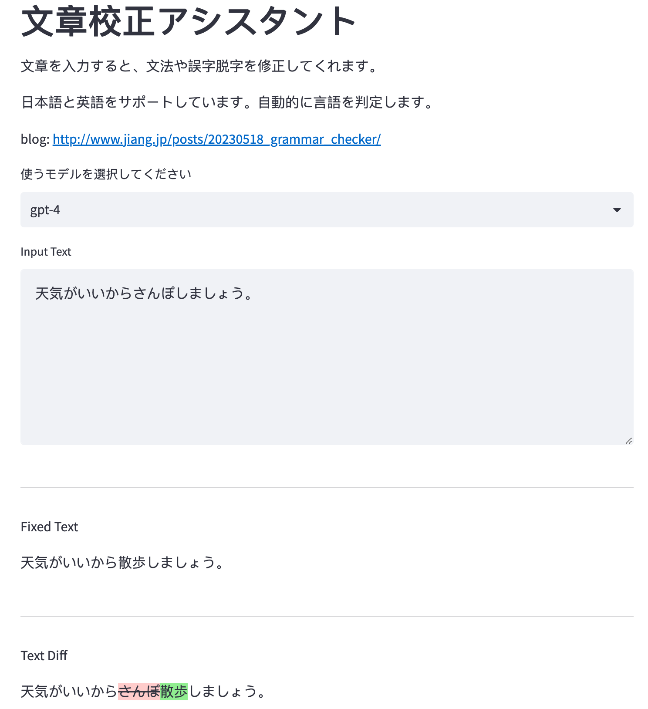

# GPT文書校正ツール

GPT Grammar Checkerは、OpenAIのGPT-3.5-turboまたはGPT-4モデルを使用して日本語と英語の文書を校正するためのアシスタントツールです。Streamlitを使ってWebアプリとして構築されています。

## **特徴**

-   日本語と英語の文法や誤字脱字を自動的に修正します。

-   入力されたテキストの言語を自動的に判定します。

-   校正結果を元のテキストと比較して表示します

-   ユーザーが毎回校正のプロンプトを書く手間を省きます。

プロジェクトのメインの流れは以下です。

ここで実際に使うことができます。<https://dayuanjiang-gpt-grammar-checker-app-7exi89.streamlit.app/>

ブログ<http://www.jiang.jp/posts/20230518_grammar_checker/>

